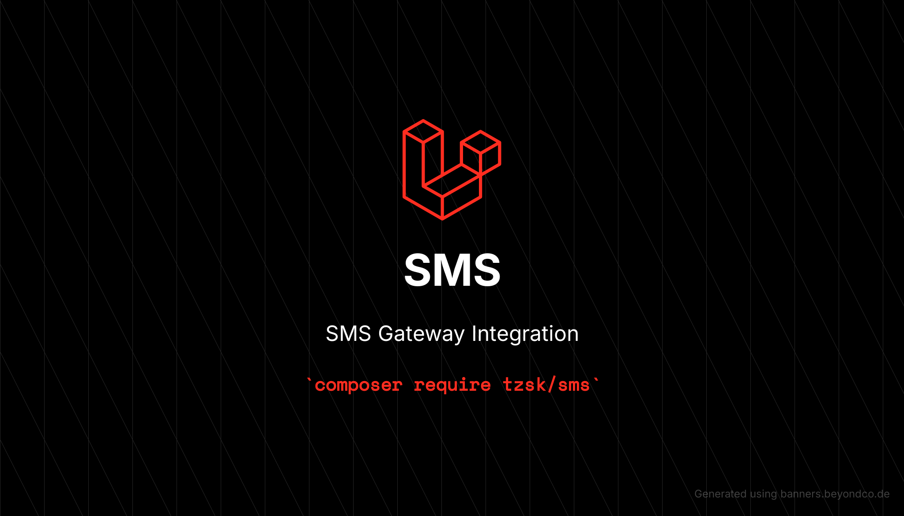

# :gift: Laravel SMS Gateway




[](https://packagist.org/packages/tzsk/sms)
[](https://github.com/tzsk/sms/actions?query=workflow%3ATests+branch%3Amaster)
[](https://packagist.org/packages/tzsk/sms)

This is a Laravel Package for SMS Gateway Integration. Now sending SMS is easy and reliable.

List of supported gateways:

-   [AWS SNS](https://aws.amazon.com/sns/)
-   [Textlocal](http://textlocal.in)
-   [Twilio](https://www.twilio.com)
-   [Clockwork](https://www.clockworksms.com/)
-   [LINK Mobility](https://www.linkmobility.com)
-   [Kavenegar](https://kavenegar.com)
-   [Melipayamak](https://www.melipayamak.com)
-   [Melipayamakpattern](https://www.melipayamak.com)
-   [Smsir](https://www.sms.ir)
-   [Tsms](http://www.tsms.ir)
-   [Farazsms](https://farazsms.com)
-   [Farazsmspattern](https://farazsms.com)
-   [SMS Gateway Me](https://smsgateway.me)
-   [SmsGateWay24](https://smsgateway24.com/en)
-   [Ghasedak](https://ghasedaksms.com/)
-   [Sms77](https://www.sms77.io)
-   [SabaPayamak](https://sabapayamak.com)
-   [LSim](https://sendsms.az/)
-   [Rahyabcp](https://rahyabcp.ir/)
-   [Rahyabir](https://sms.rahyab.ir/)
-   [D7networks](https://d7networks.com/)
-   [Hamyarsms](https://hamyarsms.com/)
-   [SMSApi](https://www.smsapi.si/)

-   Others are under way.

## :package: Install

Via Composer

```bash
$ composer require tzsk/sms
```

## :zap: Configure

Publish the configuration file:

```bash
$ php artisan sms:publish
```

In the configuration file, you can set the default driver to use for sending your SMS messages. However, you can also seamlessly change the driver at
runtime.

Choose the gateway you would like to use for your application. Then, set it as the default driver so that you do not have
to specify it every time. You can also configure and use multiple gateways within the same project.

```php
// Eg. if you want to use SNS.
'default' => 'sns',
```

Then fill the credentials for that gateway in the drivers array.

```php
// Eg. for SNS.
'drivers' => [
    'sns' => [
        // Fill all the credentials here.
        'key' => 'Your AWS SNS Access Key',
        'secret' => 'Your AWS SNS Secret Key',
        'region' => 'Your AWS SNS Region',
        'from' => 'Your AWS SNS Sender ID', //sender
        'type' => 'Tansactional', // Or: 'Promotional'
    ],
    ...
]
```

#### Textlocal Configuration:

Textlocal is added by default. You simply need to update the credentials in the `textlocal` driver section.

#### AWS SNS Configuration:

If you want to use AWS SNS, you must install the required composer library first:

```bash
composer require aws/aws-sdk-php
```

#### Clockwork Configuration:

If you want to use Clockwork, you must install the required composer library first:

```bash
composer require mediaburst/clockworksms
```

#### Twilio Configuration:

If you want to use Twilio, you must install the required composer library first:

```bash
composer require twilio/sdk
```

Then, simply update the credentials in the `twilio` driver section.

#### Melipayamak or Melipayamakpattern Configuration:

If you want to use Melipayamak or Melipayamakpattern, you must install the required composer library first:

```bash
composer require melipayamak/php
```

#### Kavenegar Configuration:

If you want to use Kavenegar, you must install the required composer library first:

```bash
composer require kavenegar/php
```

#### SMS Gateway Me Configuration:

If you want to use SMS Gateway Me, you must install the required composer library first:

```bash
composer require smsgatewayme/client
```

## :fire: Usage

You can easily send SMS messages in your application code like this:

```php
# On the top of the file.
use Tzsk\Sms\Facades\Sms;

////

# In your Controller.
Sms::send("this message", function($sms) {
    $sms->to(['Number 1', 'Number 2']); # The numbers to send to.
});
# OR...
Sms::send("this message")->to(['Number 1', 'Number 2'])->dispatch();

# If you want to use a different driver.
Sms::via('gateway')->send("this message", function($sms) {
    $sms->to(['Number 1', 'Number 2']);
});
# OR...
Sms::via('gateway')->send("this message")->to(['Number 1', 'Number 2'])->dispatch();

# Here gateway is explicit : 'twilio' or 'textlocal' or any other driver in the config.
# The numbers can be a single string as well.

# If you are not a Laravel's facade fan, you can use sms helper:

sms()->send("this message", function($sms) {
    $sms->to(['Number 1', 'Number 2']); # The numbers to send to.
});

sms()->send("this message")->to(['Number 1', 'Number 2'])->dispatch();

sms()->via('gateway')->send("this message", function($sms) {
    $sms->to(['Number 1', 'Number 2']);
});

sms()->via('gateway')->send("this message")->to(['Number 1', 'Number 2'])->dispatch();

# Change the from|sender|sim value with from() option:

sms()->via('gateway')->send("this message")->from('Your From Number | Sender Value | Sim Value ')->to(['Number 1', 'Number 2'])->dispatch();

# Sending argument and pattern code in pattern drivers such as melipayamakpattern and farazsmspattern.

#Note: The first argument is always known as the pattern code.

sms()->via('melipayamakpattern')->send("patterncode=123 \n arg1=name \n arg2=family")->to(['Number 1', 'Number 2'])->dispatch();

```

### Runtime Configuration

You can override the default gateway configuration at runtime:

```php
# Override configuration for this specific SMS
Sms::via('gateway')
    ->config(['from' => 'CUSTOM-SENDER'])
    ->send('this message')
    ->to(['Number1', 'Number2'])
    ->dispatch();
```

## :heart_eyes: Channel Usage

First, you need to create your notification using the `php artisan make:notification` command. Then, the `SmsChannel::class` can
be used as a notification channel like below:

```php
namespace App\Notifications;

use Tzsk\Sms\Builder;
use Illuminate\Bus\Queueable;
use Tzsk\Sms\Channels\SmsChannel;
use Illuminate\Notifications\Notification;
use Illuminate\Contracts\Queue\ShouldQueue;

class InvoicePaid extends Notification implements ShouldQueue
{
    use Queueable;

    /**
     * Get the notification channels.
     *
     * @param  mixed  $notifiable
     * @return array|string
     */
    public function via($notifiable)
    {
        return [SmsChannel::class];
    }

    /**
     * Get the recipients and body of the notification.
     *
     * @param  mixed  $notifiable
     * @return Builder
     */
    public function toSms($notifiable)
    {
        return (new Builder)->via('gateway') # via() is Optional
            ->send('this message')
            ->to('some number');
    }
}
```

> **Tip:** You can use the same Builder Instance in the send method.

```php
$builder = (new Builder)->via('gateway') # via() is Optional
    ->send('this message')
    ->to('some number');

Sms::send($builder);

# OR...
$builder = (new Builder)->send('this message')
    ->to(['some number']);

Sms::via('gateway')->send($builder);
```

#### Custom Made Driver, How To:

First, you must define the name of your driver in the drivers array and specify any configuration parameters you need.

```php
'drivers' => [
    'textlocal' => [...],
    'twilio' => [...],
    'my_driver' => [
        ... # Your Config Params here.
    ]
]
```

Next, you need to create a Driver Map Class that will be used to handle sending the SMS. Your driver class simply needs to
extend `Tzsk\Sms\Contracts\Driver`.

For example, if you created a class: `App\Packages\SMSDriver\MyDriver`.

```php

namespace App\Packages\SMSDriver;

use Tzsk\Sms\Contracts\Driver;

class MyDriver extends Driver
{
    /**
    * You Should implement these methods:
    *
    * 1. boot() -> (optional) Initialize any variable or configuration that you need.
    * 2. send() -> Main method to send messages.
    *
    * Note: settings array will be automatically assigned in Driver class' constructor.
    *
    * Example Given below:
    */

    /**
    * @var mixed
    */
    protected $client;

    protected function boot() : void
    {
        $this->client = new Client(); # Guzzle Client for example.
    }

    /**
    * @return object Ex.: (object) ['status' => true, 'data' => 'Client Response Data'];
    */
    public function send()
    {
        $this->recipients; # Array of Recipients.
        $this->body; # SMS Body.

        # Main logic of Sending SMS.
        ...
    }

}
```

Once you create this class, you must specify it in the `sms.php` configuration file under the `map` section.

```php
'map' => [
    ...
    'my_driver' => App\Packages\SMSDriver\MyDriver::class,
]
```

**Note:-** Ensure that the key of the `map` array is exactly identical to the key of the `drivers` array.

## :microscope: Testing

```bash
composer test
```

## :date: Changelog

Please see [CHANGELOG](CHANGELOG.md) for more information on what has changed recently.

## :heart: Contributing

Please see [CONTRIBUTING](.github/CONTRIBUTING.md) for details.

## :lock: Security Vulnerabilities

Please review [our security policy](../../security/policy) on how to report security vulnerabilities.

## :crown: Credits

-   [Kazi Ahmed](https://github.com/tzsk)
-   [All Contributors](../../contributors)

## :policeman: License

The MIT License (MIT). Please see [License File](LICENSE.md) for more information.
